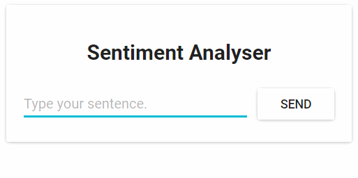
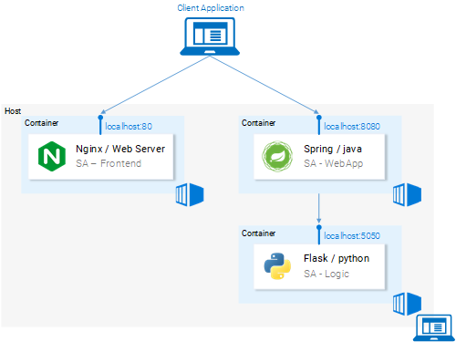
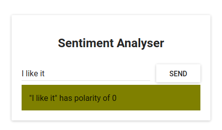
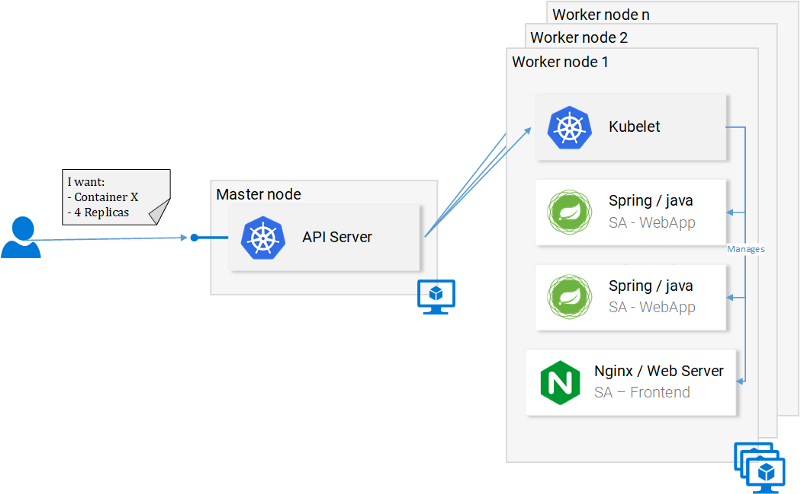

# This repo is used for kubernetes learning

## Origin

Original article can be found in [Learn Kubernetes in Under 3 Hours: A Detailed Guide to Orchestrating Containers](https://medium.freecodecamp.org/learn-kubernetes-in-under-3-hours-a-detailed-guide-to-orchestrating-containers-114ff420e882)

Original Repository can be found [here](https://github.com/rinormaloku/k8s-mastery)

## What's new

- Add kubernetes config at each repo (instead of gathering them)
- Try to deploy on AWS EKS
- Try advance features like logging or monitoring
- Know how to develop at local

## Application Demo

The application takes one sentence as input, using Text Analysis, calculates the emotion of the sentence.



From the technical perspective, the application consists of three microservices. Each has one specific functionality:

* SA-Frontend: a Nginx web server that serves our ReactJS static files.
* SA-WebApp: a Java Web Application that handles requests from the frontend.
* SA-Logic: a python application that performs Sentiment Analysis.


This interaction is best illustrated by showing how the data flows between them:

1. A client application requests the index.html (which in turn requests bundled scripts of ReactJS application)
2. The user interacting with the application triggers requests to the Spring WebApp.
3. Spring WebApp forwards the requests for sentiment analysis to the Python app.
4. Python Application calculates the sentiment and returns the result as a response.
5. The Spring WebApp returns the response to the React app. (Which then represents the information to the user.)

## Check each service

### Front-end

```javascript
npm install
npm start
```

You should access it on localhost:3000 to take a look. Now make front-end production ready by:

```javascript
npm run build
```

This generates a folder named build in your project tree, which contains all the static files needed for our ReactJS application.

Next, let's dockerize front-end.

```javascript
docker build -f Dockerfile -t sa-frontend .
docker run -d -p 80:80 sa-frontend
```

You should be able to access the react application at `locahost:80`

### Logic

```javascript

docker build -f Dockerfile -t sa-logic .
docker run -d -p 5050:5000 sa-logic
```

### Webapp

```javascript
bash build.bash
docker build -f Dockerfile -t sa-webapp .
docker run -d -p 8080:8080  -e SA_LOGIC_API_URL='http://<container_ip or docker machine ip>:5000' sa-webapp
```

<container_ip or docker machine ip> can be found by using

```javascript
docker inspect <sa-logic-container-id>
```

Now you get your microservices running:



Try some sentences *I like it* to check if it works



If there are any issues, use `docker container logs` to check service.


## Bring kubernetes to your application

Check out this [post]() to have an overview of kubernetes architecture

Our application in kubernetes could be organized like this:




Deployment steps we will proceed include:

* Install tools
* Create and start a kubernetes cluster
* Verify cluster
* Deploy kubernetes dashboard
* Access dashboard
* Deploy service to cluster
* Setup logging
* View logs
* ....

### Install tools

Since we will use EKS to deploy Kubernetes so you should have one with administration access. You also need fork the repo so you can have Github access token to setup CI/CD later. This part only focuses on deploy locally so having an ubuntu OS is enough !

* 